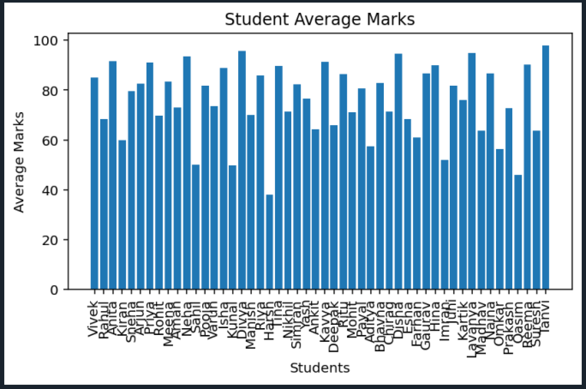
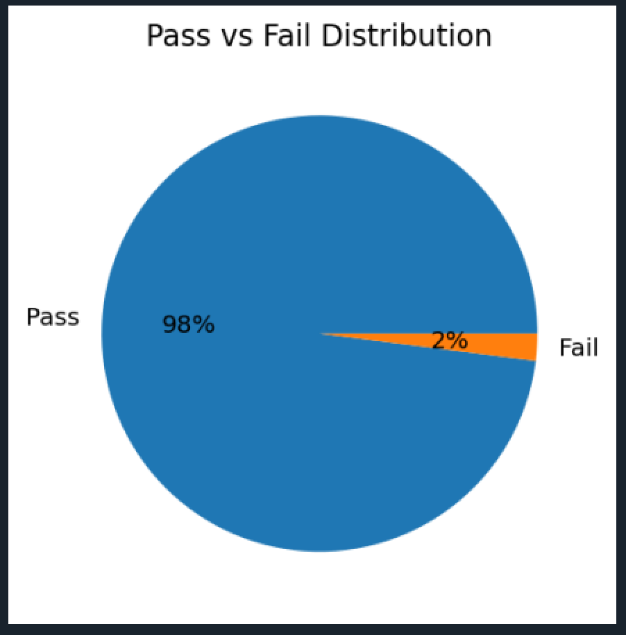

# 🎓 Student Performance Analyzer

A **menu-driven Python application** that analyzes student academic performance using Object-Oriented Programming, Pandas, and Matplotlib.  
This project demonstrates clean modular architecture, data analysis, and visualization — designed as a beginner-to-intermediate data science portfolio project.

---

## 🚀 Features

✨ Find Class Topper automatically  
📊 Calculate Overall Class Average  
✅ Pass / Fail Analysis  
🔎 Search Student by Name  
🏆 Top 5 Student Ranking  
📈 Bar Chart Visualization  
🥧 Pass vs Fail Pie Chart  
🧭 Interactive Menu-Based Interface  

---

## 🧱 Project Architecture

---

## 🛠️ Tech Stack

- 🐍 **Python**
- 📊 **Pandas**
- 📈 **Matplotlib**
- 🧱 **Object-Oriented Programming**

---

## ⚙️ Installation & Setup

### 1️⃣ Clone the Repository

### 2️⃣ Install Dependencies

### 3️⃣ Run the Application

---

## 📊 Sample Output

### 📈 Bar Chart Visualization

### 🥧 Pass vs Fail Pie Chart

Example menu:

===== STUDENT PERFORMANCE ANALYZER =====
1. Show Topper
2. Show Class Average
3. Show Pass/Fail Report
4. Show Graphs
5. Search Student
6. Show Top 5 Students
7. Exit
Enter your choice: 

---

## 💡 Learning Highlights

This project demonstrates:

✔ Modular Python Project Structure  
✔ Object-Oriented Design  
✔ Data Processing with Pandas  
✔ Visualization using Matplotlib  
✔ Git & GitHub Workflow  

---

## 👨‍💻 Author

**Vivek Pal**  
MCA Student | Aspiring Data Scientist

🔗 GitHub: https://github.com/Vivek24x
